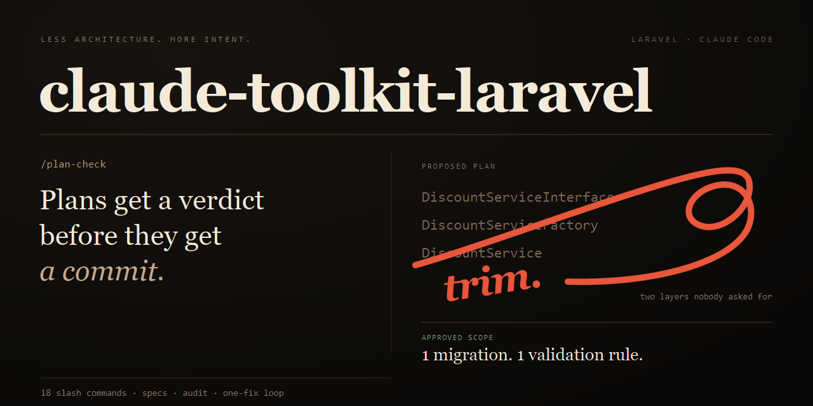
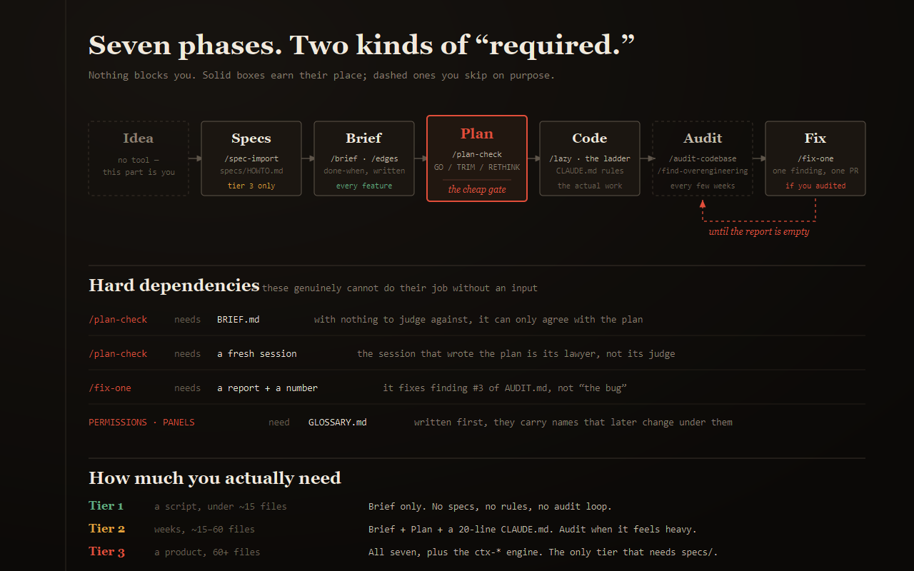
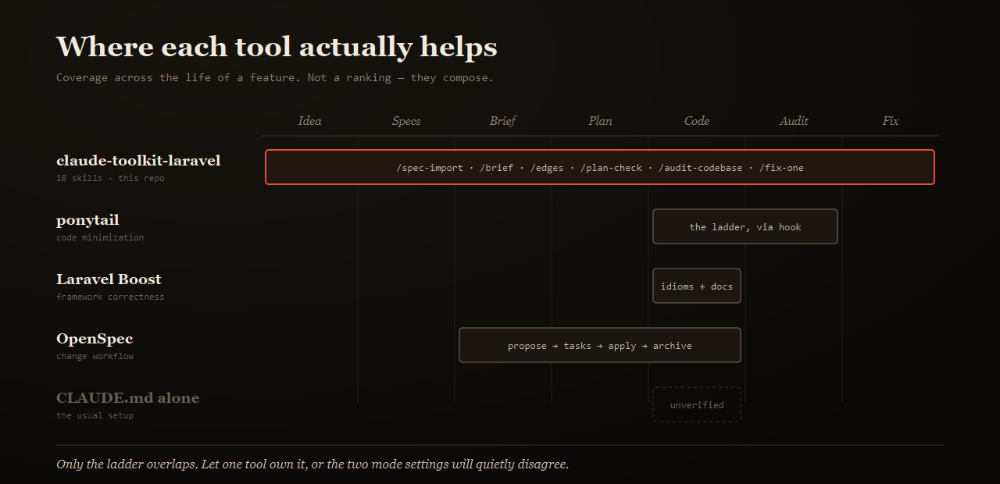
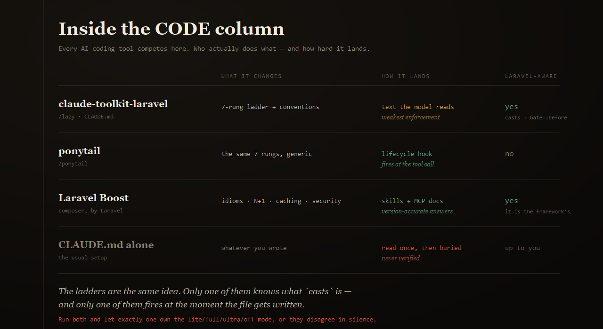

<div align="center">



**Decide before you build. Verify before you ship.**

18 Claude Code skills, a product-spec starter, and Laravel-shaped rules —
so the agent knows *what* to build and *how you'd know it worked*.

[](LICENSE)


**English** · [فارسی](README.fa.md)

</div>

---

## What this is

A set of **slash commands you invoke deliberately** — not a background rule file,
not a plugin that changes how the model writes code. Each one covers a moment
where AI-assisted projects reliably go wrong: the requirement nobody pinned
down, the plan nobody refereed, the bug report nobody closed.

Nothing here runs on its own. Every skill is `disable-model-invocation: true`.
You type `/plan-check`, or it never happens.

### What fires when

The commands cover four different moments, and only one of them is automatic:

| Moment | What covers it | Who fires it |
|---|---|---|
| **Before the code** — on the plan | `/plan-check` | you |
| **While it is being written** | the ladder in `CLAUDE.md` | always on — and the weakest link |
| **Right after** — on the diff | `/explain` scope audit | you |
| **Every few weeks** — on the codebase | `/find-overengineering` | you |

`/find-overengineering` is a sweep, not a per-feature check. It ranks by
counting across a body of code, so on a 40-line diff there is nothing to rank
and it only produces noise. The tool for that moment is `/explain`, which
traces every changed file back to the thing that asked for it and reports the
ones that trace to nothing.

## Why you'd want it

Take a real request: *"add discount codes to checkout."*

<table>
<tr><th width="50%">Without</th><th width="50%">With</th></tr>
<tr valign="top"><td>

Agent starts writing. You get:

- a `DiscountService` with an interface and a factory
- a new composer package for percentage math
- a `discount_rules` table with a polymorphic relation
- 6 files, 400 lines, in a plausible-looking PR

Three weeks later: nobody can say whether stacking two codes was supposed to
work, because it was never decided — only implemented.

</td><td>

```
/brief
→ done-when: "a valid code cuts the
  total; an expired one doesn't;
  two codes cannot stack"

[plan] → /clear → /plan-check
→ VERDICT: TRIM
  the factory has one consumer
  the package is 3 lines of math

code → 1 migration, 1 rule, ~40 lines
```

The stacking question got answered **before** the code, in writing.

</td></tr>
</table>

The value isn't that the agent writes less. It's that **the decisions got made
by you, on purpose, and written down where the next session can read them.**

---

## The problem

The problem isn't that Claude writes bad code. It's that it has **no way to
tell whether its work was right**, and **no idea how things are done in this
project**.

So it guesses. Consistently, plausibly, and differently every session.

This toolkit fixes three things:

| Problem | Fix |
|---|---|
| "It does it differently every time" | Rule files that hold the project's conventions |
| "I can't tell if it did it right" | Every task ends with a runnable check |
| "It finds things but never fixes them" | A one-finding-at-a-time repair loop |

And one principle repeated everywhere:

> **Default down, not up.** Most work needs none of this.

---

## Quick start

```bash
# 1. clone into your project as _toolkit/
cd my-laravel-project
git clone https://github.com/abdian/claude-toolkit-laravel.git _toolkit

# 2. install the starter 6 skills (project-scoped)
bash _toolkit/install.sh          # Windows: powershell _toolkit\install.ps1

# 3. if you're starting a product from scratch, take the specs starter
cp -R _toolkit/specs ./specs

# 4. open Claude Code from the project root
claude
```

Then, inside Claude Code:

```
/skills          # confirm they loaded
/start           # once per project — picks a tier, sets up only that
```

> **On the nested repo:** cloning leaves a `.git` inside `_toolkit/`. Either add
> `_toolkit/` to your project's `.gitignore`, or drop the history and vendor it:
> ```bash
> rm -rf _toolkit/.git      # now _toolkit/ commits with your project
> ```
> Vendoring is the better default — the installed skills are symlinks into
> `_toolkit/skills/`, so teammates who clone your project get them working.

<details>
<summary><b>Install options</b></summary>

```bash
bash install.sh                  # starter 6, into THIS project
bash install.sh --all            # all 18
bash install.sh --all --global   # into ~/.claude/skills instead
bash install.sh --all --copy     # real copies instead of symlinks
bash install.sh --all --force    # overwrite what's already there
```

PowerShell equivalents use switches: `-All`, `-Global`, `-Copy`, `-Force`.

Default scope is **project** (`.claude/skills/`), so skills are committable and
each project can pin its own version. Default mode is **symlink**; where real
symlinks are unavailable (Windows without Developer Mode) the installer says so
and installs real copies instead.

> ⚠️ A personal skill (`~/.claude/skills/`) **overrides** a project skill of the
> same name. If you installed globally before, a project install will have no
> effect.

</details>

---

## You have a product document. Now what?

This is the path most people arrive on: a Word file full of decisions, and an
empty repo.

```
 your-document.docx
        │
        │  /spec-import your-document.docx
        ▼
   specs/*.md  ──────────►  a gap report of everything it refused to guess
        │
        │  /clear, then interview only the gaps
        ▼
   specs/ complete  ──────►  now code can start
```

The important part is not the files it fills. It's the **gap report**.

`/spec-import` writes only what the document actually says. Every blank stays
blank and gets reported. Filling a blank with a plausible answer is the worst
possible outcome — you never find out a decision wasn't made, only filled, and
six months of code gets built on it.

`.docx` is converted by the bundled `docx2md.py` — Python standard library
only, no pandoc, no `pip install`. It keeps tables, which matters, because
`GLOSSARY`, `PERMISSIONS` and `PANELS` are all tables.

**No document?** Fill `specs/` by hand instead — [`specs/HOWTO.md`](specs/HOWTO.md)
is an eight-session roadmap, about one afternoon. The order is mandatory: it's
a dependency chain, not a preference.

| # | File | Who decides | Time | Cost of getting it wrong |
|---|---|---|---|---|
| 1 | `VISION.md` | **you** | 30–45 min | low |
| 2 | `GLOSSARY.md` | **you** | 30 min | ⚠️ **highest — names freeze into tables** |
| 3 | `PERMISSIONS.md` | **you** | 20–30 min | medium |
| 4 | `INTEGRATIONS.md` | **you** + Claude | 20 min | medium |
| 5 | `FLOWS.md` · `PANELS.md` | Claude, from 1–4 | 35 min | low |
| 6 | `contracts/*.yaml` | Claude | 20 min | medium |
| 7 | `BACKLOG.md` | you | 15 min | low |

---

## The seven phases — and how binding each one is



**Nothing here blocks you.** No skill refuses to run, no hook stops a commit.
What's "required" is of two very different kinds, and mixing them up is what
makes this confusing:

| Kind | Meaning |
|---|---|
| **Hard dependency** | The skill literally cannot do its job without an input. `/plan-check` with no `BRIEF.md` has nothing to judge against — it will just agree with the plan. |
| **Discipline** | Skipping it breaks nothing today. It charges you later, with interest. |

<details open>
<summary><b>1 · IDEA — no tool</b></summary>

**What it is:** you, deciding there's something worth building.

**Required?** There's nothing to run. If you can't say in one sentence who it's
for and what breaks without it, no tool downstream will rescue that.

</details>

<details>
<summary><b>2 · SPECS — the product's source of truth</b></summary>

**What it is:** the decisions a codebase can't hold — what the thing is, what
each entity is *called*, who may do what, what happens when the payment gateway
is down.

**How you use it:**
```bash
cp -R _toolkit/specs ./specs
```
Then either `/spec-import your-doc.docx` if you already have a document, or work
through [`specs/HOWTO.md`](specs/HOWTO.md) — eight sessions, about an afternoon.

**Required?** **Tier 3 only.** A script does not need a `GLOSSARY.md`. But
within Tier 3 the *order* is a hard dependency: `GLOSSARY.md` before anything
that names an entity, because a merged migration is frozen and a wrong table
name outlives the project.

**Cost:** `/spec-import` ≈ 1,800 tokens. Renaming a table across 40 files six
months in: considerably more.

</details>

<details>
<summary><b>3 · BRIEF — what "done" means, in writing</b></summary>

**What it is:** your rough description turned into inputs, outputs, **out of
scope**, and a **done-when** condition that can actually be checked.

**How you use it:**
```
/brief
add discount codes to checkout
```
`/edges` is the optional companion — it lists what could break, expecting most
items to be deliberately ignored.

**Required?** For anything you'd call a feature, yes — as discipline. This is
the cheapest phase in the whole set and it's the input `/plan-check` needs.

Without a written done-when, "finished" is a feeling. Two people will have
different ones, and so will your next session.

**Cost:** ≈ 950 tokens.

</details>

<details>
<summary><b>4 · PLAN — ⭐ the gate that pays for itself</b></summary>

**What it is:** a referee that reads the plan against `BRIEF.md` and the
simplicity rules, and returns **GO**, **TRIM**, or **RETHINK**.

**How you use it:**
```
[get a plan]  →  copy it  →  /clear  →  /plan-check  →  paste
```

**Required?** Two hard dependencies, and both matter:

- **It needs `BRIEF.md`.** With nothing to judge against it can only agree.
- **It needs a fresh session.** The session that wrote the plan inherited its
  own assumptions — it's the plan's lawyer, not its judge. This is the rule
  people skip, and skipping it makes the whole phase theatre.

Skip the phase entirely for a one-line change. For anything with more than
about three steps, this is the cheapest moment over-engineering can be caught —
before it's code anyone is attached to.

**Cost:** ≈ 780 tokens. The cheapest skill here, guarding the most expensive
mistake.

</details>

<details>
<summary><b>5 · CODE — the part everyone already has</b></summary>

**What it is:** the actual work. The toolkit's contribution is the rules the
agent reads while doing it: `templates/CLAUDE.laravel.md.template`, with a
seven-rung simplicity ladder in Laravel terms.

**How you use it:** copy the template to `CLAUDE.md`, fill in the brackets.
`/lazy lite|full|ultra|off` changes how hard the ladder is pushed and stores the
level in `CLAUDE.md`, so it survives the session.

**Required?** The code, obviously. The ladder is discipline — and it's the one
place other tools overlap with this one (see [comparison](#how-it-compares)).

**Cost:** the template sits in context every message, ≈ 3,800 tokens, cached
after the first turn. `/lazy` itself ≈ 630 tokens, and only when called.

</details>

<details>
<summary><b>6 · AUDIT — periodic, not per-feature</b></summary>

**What it is:** two different sweeps that should not be run together.
`/audit-codebase` looks for bugs and convention drift → `AUDIT.md`.
`/find-overengineering` looks for needless complexity → `COMPLEXITY.md`.

**How you use it:**
```
/audit-codebase app/Services    →  /clear  →  /find-overengineering app/Services
```
Separate sessions, on purpose. They ask opposite questions, and a session
holding both answers badly.

**Required?** No — and running it every week is a smell. Every few weeks, or
before a release. Tier 1 never.

`/find-overengineering` has a **mandatory KEEP category**, so it can't justify
itself by declaring everything bloated.

**Cost:** ≈ 1,300 and ≈ 1,900 tokens.

</details>

<details>
<summary><b>7 · FIX — one finding, or the report rots</b></summary>

**What it is:** a repair loop that fixes exactly one numbered finding.

**How you use it:**
```
/clear  →  /fix-one AUDIT.md 3
```

**Required?** **If you audited, yes.** An audit with no fix loop is a file that
gets longer and less true until someone deletes it. That's the failure this
phase exists for.

A **hard dependency**: it needs a report *and a number*. `/fix-one` is not "fix
the bug" — it's "fix finding #3", and that specificity is what keeps the diff
small enough to review.

Six mandatory steps, and step 5 is the one that makes it work: `git diff --stat`
must show only the file with the bug, its test, and files the report named.
Anything else is drift, and gets reverted.

**Cost:** ≈ 950 tokens per finding.

</details>

### What this costs you, in tokens

Measured on this repo, not estimated:

| | Tokens | When |
|---|---|---|
| All 18 skill descriptions | **≈ 780** | every message, cached |
| `CLAUDE.laravel.md` template | ≈ 3,800 | every message, cached |
| One skill body | 630 – 1,900 | only when you call it |
| All 18 bodies at once | ≈ 18,400 | never happens in practice |

A phase costs **under 2,000 tokens** to run. The mistake it's there to prevent —
a feature built on a decision nobody made, then re-read, argued about and
reverted — costs an order of magnitude more. The first number is measured; the
second is an estimate, but not a close call.

The skills are the cheap part. What costs real tokens is a long session that
drifted, which is exactly what `/clear` between phases exists to stop.

---

## The 18 skills

Every skill is `disable-model-invocation: true` — it runs **only when you ask**,
never on the model's initiative.

### Front door

| Command | What it does |
|---|---|
| `/start` | Asks 2–3 questions, assigns a **tier**, sets up only what that tier earns |
| `/next` | Reads project state, names **one** next action. Not a list, not a roadmap |

Tiers exist so small projects don't get big-project ceremony:

| Tier | When | Sets up |
|---|---|---|
| 1 — Light | one-off, under ~15 files | **Nothing.** A brief and one real test |
| 2 — Medium | a few weeks, ~15–60 files | A `CLAUDE.md` of at most 20 lines |
| 3 — Full | long-lived, 60+ files | Full `ctx-*` pass, rules, audit loop |

### Before code

| Command | What it does |
|---|---|
| `/spec-import <doc>` | Routes a brain-dump document into `specs/`. Reports gaps, never guesses |
| `/brief` | Rough description → `BRIEF.md` with inputs, outputs, **out of scope**, **done-when** |
| `/edges` | Lists edge cases before code — expecting most to be deliberately ignored |
| `/plan-check` | ⭐ Referees a plan against the brief. Verdict: **GO / TRIM / RETHINK** |

> `/plan-check` must run in a **fresh session**. The session that wrote the plan
> inherited its own biases — it's the plan's lawyer, not its judge.

### After code

| Command | What it does |
|---|---|
| `/audit-codebase [path]` | Bugs, dead code, convention drift → `AUDIT.md` |
| `/find-overengineering [path]` | Needless complexity → `COMPLEXITY.md`, with a mandatory KEEP category |
| `/debt [path]` | Harvests `lazy:` markers into a ranked `DEBT.md` |
| `/lazy [lite\|full\|ultra\|off]` | Sets how hard the simplicity ladder is enforced |
| `/fix-one <report> <n>` | ⭐ Fixes exactly one finding |
| `/explain [commit\|--staged]` | Explains what changed and why, as an HTML report — and flags what nothing asked for |
| `/security-review [path]` | Audits for exploitable defects — every finding names who can reach it and how |

`/fix-one` is the strictest contract here — six mandatory steps:

1. **Failing test first.** A fix with no demonstrated failure is a guess
2. **Root cause, not symptom.** `@ts-ignore`, `any`, empty `catch {}`, `.skip()` are forbidden
3. **Smallest change that works.** If a proper fix means refactoring — stop and ask
4. **Prove it's fixed.** New test, full suite, typecheck
5. **Prove you stayed in scope.** `git diff --stat`; any extra file is drift
6. Commit

#### `/explain` — the receipt

Runs over any scope and produces one self-contained HTML report:

```
/explain                 # everything uncommitted — the usual one
/explain --staged        # right before a commit
/explain HEAD            # a commit, saved as reports/<commit-subject>.html
/explain --project       # orientation doc for the whole codebase
```

The report has three parts that matter: **what changed for the person using the
app**, **what changed in the code** (grouped by the reason, not the directory),
and a **scope audit**.

The scope audit is the point. Every changed file must trace back to something
that asked for it — a line in `BRIEF.md`, a numbered finding, a row in
`specs/`, the commit message. Anything that doesn't trace is reported as
`UNTRACED` with its line count, in `/fix-one`-compatible format:

```
- [ ] #2 UNTRACED app/Support/Formatter.php (+84/−0) — new helper class
      nobody asked for: no finding, brief line, or spec row references this
```

> "Refactored for clarity" is what an untraced change looks like when someone
> is being polite about it. The skill is told not to write that sentence.

A clean audit is a real result — if the diff is minimal and everything traces,
it says so.

### Security — three layers, not one command

Security cannot be a skill you remember to invoke, because the moment you needed
it has already passed. It sits in three places:

| When | What | Always on? |
|---|---|---|
| **Planning** | `/plan-check` step 6 — a step that crosses a trust boundary must already name who may reach it, what validates the shape, and what shape leaves | you run it |
| **Writing** | **Trust boundaries** section in `CLAUDE.laravel.md` — the only always-on layer | ✅ yes |
| **Reviewing** | `/security-review` — a Laravel-shaped audit, `/fix-one` compatible | you run it |

The write-time layer is deliberately in the template rather than in a skill, and
it carries one rule that overrides everything else here:

> **The ladder makes code smaller. It never makes a boundary thinner.**
> Trust-boundary rules hold even under `/lazy ultra`.

`/security-review` is built around one discipline: **every finding names who can
reach it and through what request.** No reachable path means it is not a
finding — it goes in HARDENING instead. That is what stops a security report
from turning into forty speculative lines nobody reads.

It looks where Laravel apps actually break, in order: missing Policies, IDOR
through route model binding, mass assignment as privilege escalation, then
injection where the framework was stepped around (`whereRaw`, `{!! !!}`,
`->orderBy($request->sort)`), then uploads, sessions, what leaks (API Resources
returning whole models, secrets in queue payloads), and finally unverified
webhook signatures.

> It is a code read, not a penetration test, and it does not replace one for
> anything handling money or identity. The skill says so in its own output.

### Context engine — Tier 3 only

`/ctx-audit` → `/ctx-interview` → `/ctx-generate` → `/ctx-verify` → `/ctx-learn`

Discovers the project's conventions, confirms them with you, and generates
`CLAUDE.md` and `.claude/rules/`. `/ctx-verify` is the unusual one: it runs the
same task in fresh subagents **with and without** the generated context and
reports which rules actually changed behaviour and which are dead weight.

> ⚠️ `/ctx-generate` **overwrites** `CLAUDE.md`. If you hand-tuned it from
> `templates/CLAUDE.laravel.md.template`, commit first — `git checkout CLAUDE.md`
> is your undo.

---

## The daily loop

```
/brief → /edges* → plan → /clear → /plan-check → code
   → test → /fix-one as needed → "commit" → /clear
                                     * = only when it earns it

every few weeks:  /audit-codebase → /clear → /find-overengineering → /debt
```

---

## What's in the box

```
claude-toolkit-laravel/
├── install.sh · install.ps1     project-scoped installer, bash + PowerShell
├── docx2md.py                   .docx → markdown, stdlib only
├── skills/                      18 skills
├── templates/                   CLAUDE.md · CLAUDE.laravel.md · settings.json
├── specs/                       product-spec starter (13 files)
├── docs/
│   ├── REFERENCE.fa.md          full reference (Persian)
│   ├── TUTORIAL.fa.md           step-by-step tutorial (Persian)
│   ├── guide.html               interactive guide, filterable by tier
│   └── tutorial.html            interactive tutorial
└── assets/cover.png
```

### The Laravel template

`templates/CLAUDE.laravel.md.template` carries the parts a generic rules file
can't: artisan/Pest/Pint/Larastan commands, the migration policy (a merged
migration is frozen), and a **seven-rung simplicity ladder** written in Laravel
terms — a DB constraint over an application check, `casts` over an
accessor+mutator pair, `Gate::before` over a role check in ten places, read
`composer.json` before adding a package.

---

## How it compares



Most AI coding tools optimise the **CODE** column — write it better, write less
of it, write it idiomatically. That column is crowded and well served.

This toolkit lives mostly to the **left** of it: deciding what to build, writing
it down, and refereeing the plan before anyone types. And to the right: closing
findings one at a time instead of letting reports rot.

| | This toolkit | ponytail | Laravel Boost | OpenSpec |
|---|---|---|---|---|
| Product specs from a document | ✅ | — | — | — |
| Brief with a done-when condition | ✅ | — | — | — |
| Plan refereed before code | ✅ | — | — | partial |
| Simplicity ladder | ✅ Laravel-specific | ✅ generic, hook-enforced | — | — |
| Laravel idioms + version-accurate docs | partial | — | ✅ | — |
| Change workflow (propose → archive) | — | — | — | ✅ |
| Bug audit → one-at-a-time repair | ✅ | — | — | — |
| Verify the rules actually work | ✅ `/ctx-verify` | — | — | — |

### Zooming into CODE — the crowded column



That's where nearly every AI coding tool competes, so it's worth being precise
about who does what:

| | What it actually changes | How it's enforced | Laravel-aware |
|---|---|---|---|
| **This toolkit** | A 7-rung ladder + conventions in `CLAUDE.md` | Text the model reads — **weakest enforcement** | ✅ `casts`, `Gate::before`, DB constraints, `composer.json` first |
| **ponytail** | The same 7 rungs, generic wording | **Lifecycle hook** — injected at session start and tool-use | ❌ generic |
| **Laravel Boost** | Idioms, N+1, caching, security patterns | Skills + MCP `search-docs` for version-accurate answers | ✅ it's the framework's own |
| **CLAUDE.md alone** | Whatever you wrote | Read once, then buried under the session | depends on you |

Two things follow from that table.

**The ladders are the same idea.** This toolkit's and ponytail's rungs match
almost one-for-one — YAGNI → reuse → stdlib → platform → installed dep → one
line → minimum. The difference is that this one says *"a DB constraint over an
application check, `casts` over an accessor+mutator pair"*, and a generic
ladder can't.

**Enforcement is where this toolkit is weakest.** A rule in `CLAUDE.md` is read
once and then sits far from the moment code gets written. ponytail's hook fires
at the tool call. If you find the ladder drifting in long sessions, that gap is
real — and it's the honest reason to reach for ponytail.

> ⚠️ **The one real conflict:** this toolkit's `/lazy` and ponytail's
> `/ponytail` both store a `lite/full/ultra/off` mode, in different places.
> Install both and they will silently disagree — and you won't notice, because
> both behaviours look plausible.
>
> **If you run both:** delete the `lazy` skill and the "Simplicity level"
> section from `CLAUDE.md`, keep the seven Laravel rungs, and let ponytail own
> the mode.

---

## Optional companions — deliberately not vendored here

Two external toolchains pair well with this one. **Neither is copied into this
repo, and neither should be** — both generate and update their own skills, and
a frozen copy goes stale after the first `composer update`.

| Tool | Install | Adds |
|---|---|---|
| **Laravel Boost** | `composer require laravel/boost --dev` | `laravel-best-practices`, `infer-conventions`, `tailwindcss-development`, plus an MCP server with `search-docs` |
| **OpenSpec** | `npm i -g openspec && openspec init` | `openspec-propose`, `openspec-apply-change`, `openspec-explore`, and more |

The division of labour:

- **This toolkit** → what to build, and how simple to keep it
- **OpenSpec** → how to carry one specific change through
- **Boost** → write Laravel correctly, with version-accurate docs

---

## Requirements

- [Claude Code](https://claude.com/claude-code)
- `bash` (Git Bash or WSL on Windows) **or** PowerShell 5.1+
- Python 3 — only for `/spec-import` with `.docx` input

---

## License

MIT © 2026 Ali Abdian — see [LICENSE](LICENSE).
